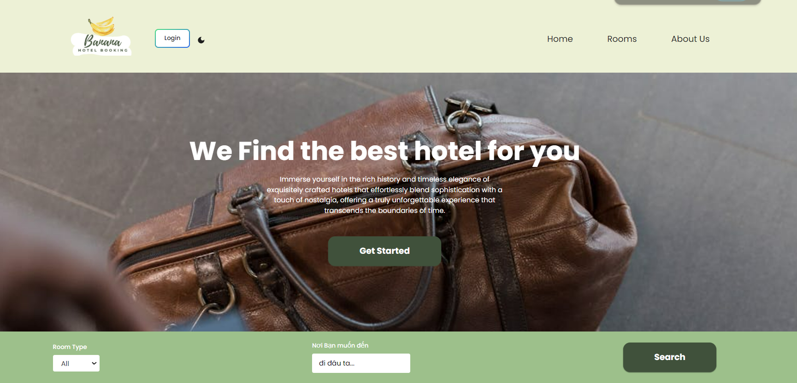
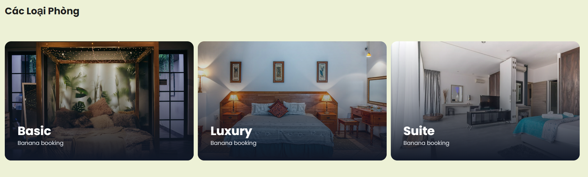
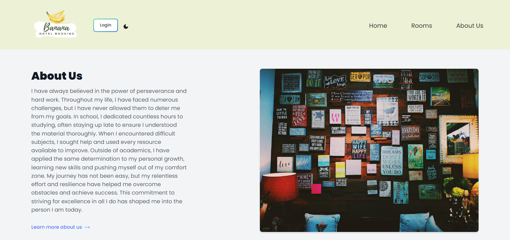
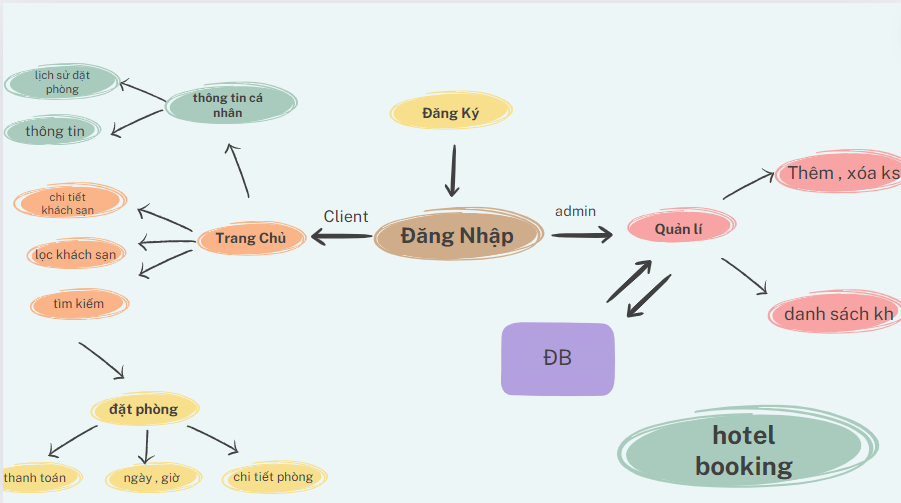

This is a [Next.js](https://nextjs.org/) project bootstrapped with [`create-next-app`](https://github.com/vercel/next.js/tree/canary/packages/create-next-app).

## Getting Started

First, run the development server:

```bash
npm run dev
# or
yarn dev
# or
pnpm dev
# or
bun dev
```

Open [http://localhost:3000](http://localhost:3000) with your browser to see the result.

You can start editing the page by modifying `app/page.tsx`. The page auto-updates as you edit the file.

This project uses [`next/font`](https://nextjs.org/docs/basic-features/font-optimization) to automatically optimize and load Inter, a custom Google Font.

## Learn More

To learn more about Next.js, take a look at the following resources:

- [Next.js Documentation](https://nextjs.org/docs) - learn about Next.js features and API.
- [Learn Next.js](https://nextjs.org/learn) - an interactive Next.js tutorial.

You can check out [the Next.js GitHub repository](https://github.com/vercel/next.js/) - your feedback and contributions are welcome!

## Deploy on Vercel

The easiest way to deploy your Next.js app is to use the [Vercel Platform](https://vercel.com/new?utm_medium=default-template&filter=next.js&utm_source=create-next-app&utm_campaign=create-next-app-readme) from the creators of Next.js.

Check out our [Next.js deployment documentation](https://nextjs.org/docs/deployment) for more details.

# Features:

- Hotel Room Management CRUD with Sanity.IO
- Đánh Giá
- Room Booking
- Thanh Toán với Stripe
- Stripe webhook
- Search (Room Type / Nơi Bạn muốn đến)
- xác thực với Auth.JS
- Typescript
- useSwr Hook
- Deployment to Vercel
- ...

# Giao diện

######6.Home




######6.Rooms

######6.About us


# Sơ đồ



# trả lời câu hỏi của các nhóm khác về seminar Gk

1. Bên cạnh các hook có sẵn thì mình có thể xây dựng các hook custom được không

- Có, bạn hoàn toàn có thể xây dựng các hook custom trong React. Các hook custom cho phép bạn tái sử dụng logic stateful mà không cần phải thay đổi cấu trúc component. Để tạo một hook custom, bạn chỉ cần tạo một hàm bắt đầu bằng chữ "use" và bên trong hàm đó bạn có thể sử dụng các hook khác của React.

2. Ưu điểm và nhược điểm khi học ReactJS

-     Ưu điểm:

* Cộng đồng lớn và hỗ trợ tốt: Với một cộng đồng đông đảo, bạn có thể dễ dàng tìm thấy tài liệu, thư viện bổ trợ, và giải đáp thắc mắc từ nhiều nguồn.
* Component-based architecture: Giúp tái sử dụng mã, dễ dàng bảo trì và mở rộng.
* Virtual DOM: Tăng hiệu suất bằng cách giảm thiểu số lần thao tác trực tiếp lên DOM thật.
* Hooks: Giúp quản lý state và các side effect một cách dễ dàng và rõ ràng hơn.

- Nhược điểm:

* Học tập ban đầu có thể khó: Đối với người mới, khái niệm về JSX, component-based architecture, và hooks có thể gây khó khăn.
* Quá nhiều cách để làm một việc: Do React chỉ là thư viện cho view, bạn sẽ cần chọn và học thêm nhiều thư viện khác để xử lý routing, state management, vv.
* Thay đổi nhanh: React và hệ sinh thái của nó thay đổi nhanh chóng, bạn cần cập nhật kiến thức liên tục.

3. Làm thế nào để cập nhật state đúng cách

- Sử dụng hàm setState của hook useState: Tránh thay đổi state trực tiếp mà luôn sử dụng hàm setState để cập nhật state.
- Tránh cập nhật state trực tiếp trong hàm render: Vì nó có thể dẫn đến vòng lặp vô hạn.
- Sử dụng useReducer cho state phức tạp: Nếu state của bạn có cấu trúc phức tạp hoặc liên quan đến nhiều loại hành động, hãy xem xét sử dụng hook useReducer.

4. ReactJS quản lý state như thế nào để có hiệu quả

- Sử dụng useState cho state đơn giản: Dễ sử dụng và hiểu.
- Sử dụng useReducer cho state phức tạp: Giúp quản lý state với các logic phức tạp hơn một cách rõ ràng và có cấu trúc.
- Context API: Để quản lý state global hoặc state cần chia sẻ giữa nhiều component mà không cần truyền props qua nhiều lớp.
- Memoization với useMemo và useCallback: Để tránh việc tính toán lại không cần thiết và giúp tối ưu hiệu suất.
- Redux hoặc các state management libraries khác: Khi bạn cần quản lý state toàn cục phức tạp và cần một giải pháp mạnh mẽ hơn Context API.

5. Lí do ReactJS được xem là một thư viện thay vì một framework?

- Tập trung vào view layer: React chỉ xử lý phần view trong ứng dụng của bạn, nó không cung cấp tất cả các công cụ cần thiết như một framework (vd: routing, form validation, state management toàn cục).
- Khả năng tích hợp linh hoạt: Bạn có thể sử dụng React trong bất kỳ phần nào của ứng dụng mà không cần phải thay đổi toàn bộ ứng dụng để sử dụng React.
- Khuyến khích lựa chọn và kết hợp: React khuyến khích bạn kết hợp với các thư viện khác để xử lý các vấn đề không thuộc về view, điều này trái ngược với một framework, nơi mà mọi thứ thường được bao gồm trong cùng một gói.
